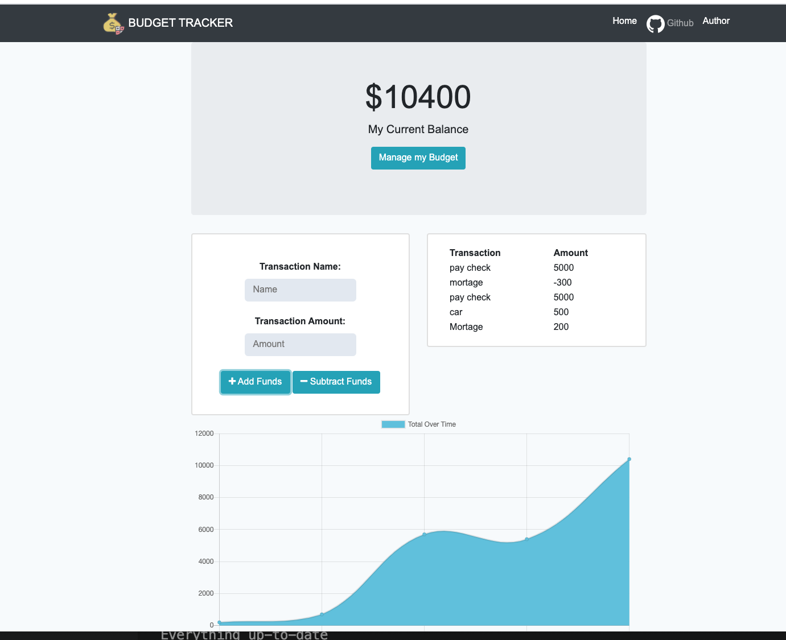

# Online-Offline Budget Tracker

## Table of Contents 

* [Usage](#usage)
* [User Story](#userstory)
* [Objective](#objective)
* [Technologies](#technologies)
* [Credits](#credits)
* [License](#license)

## Usage 

Example of front page

Heroku Deployment (https://budget-keya.herokuapp.com/)

# User Story
This app gives users a fast and easy way to track their money and allow them to access that information anytime. Having offline functionality is paramount to my applications success. The user will be able to add expenses and deposits to their budget with or without a connection. When entering transactions offline, they should populate the total when brought back online.

# Objective
The Budget Tracker uses Mongo database with a Mongoose schema to handle routes with Express.

# Technologies
* Javascript
* Node.js
* Express
* MongoDB
* Mongoose

## Questions
If you have any questions about the repo, please [open an issue](https://github.com/Ofarrell23/Online-Offline-Budget-Trackers/issues or contact me via email at keyabug@gmail.com. You can find more of my work on my GitHub, [Ofarrell23](https://github.com/Ofarrell23/).
    
## Credits
Below is a list of third-party tutorials used to help facilitate this project. There were no collaborators for this project.

* [Credits] (https://www.w3schools.com/tags/att_img_alt.asp)
* [Credits] (https://www.vikingcodeschool.com/html5-and-css3/html5-semantic-tags)
* [Credits] (https://developer.mozilla.org/en-US/docs/Web/JavaScript)

# License

